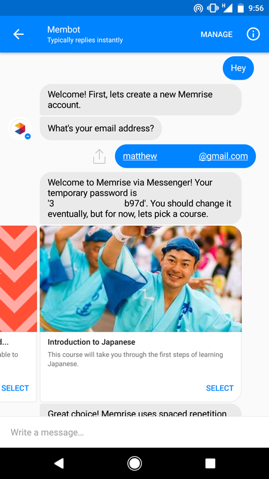
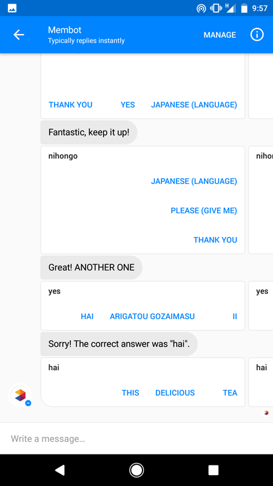

# Membot

It's Memrise-interfacing facebook chat bot!




## How it Works

By using the private memrise API, it can create an account, sign you up for courses, and quiz you on the cards within that course!

It obviously doesn't implement the entire API (and the features the chatbot _does_ support are rather hacked together).

Some interesting files:

- [/app/controllers/conversations_controller.rb](/app/controllers/conversations_controller.rb) - the ingress for the facebook chat webhook
- [/app/models/conversation.rb](/app/models/conversation.rb) - The conversation model and state machine
- [/app/services/memrise.rb](/app/services/memrise.rb) - the api client for memrise

## Setup

If you want to run this yourself, 1) good luck 2) just kidding, it's a normal rails project.

```
gem install bundler
bundle install
rails db:setup

```
